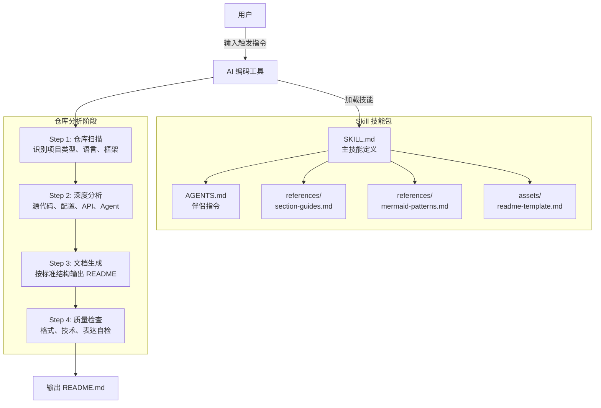

# GitHub README Writer Skill

> 基于 AI Agent 的中文 GitHub README 智能生成器 — 深度分析项目仓库，一键生成可直接发布的技术文档。

[](LICENSE)

---

## 项目简介

每个开源项目都需要一份高质量的 README，但写好它却不容易：需要理解项目全貌、梳理架构设计、编写清晰的技术文档。大多数开发者要么花大量时间手动编写，要么产出空泛的"代码复述型"文档。

**GitHub README Writer Skill** 是一个 AI 编码工具技能包（Skill），通过精心设计的 Prompt 指令链，让 AI Agent 自动完成从仓库扫描、深度分析到文档生成的完整流程。它不是简单的代码摘要工具，而是按照资深开源维护者的思维方式进行分析 —— 推断项目解决的问题、解释架构决策、展示技术亮点。

**支持平台**：Claude Code、GitHub Copilot CLI、Codex CLI、Gemini CLI、Cursor、Cline、Windsurf、Trae 等 10+ 主流 AI 编码工具。

---

## 核心能力

### 多平台一键安装

- **功能**：通过一个安装脚本自动检测本机已安装的 AI 编码工具并完成部署
- **解决的问题**：不同 AI 工具的技能目录结构各异，手动配置繁琐易错
- **价值**：一条命令完成 10 个平台的安装，支持 `--platform` 指定或 `--all` 全量安装

### 深度仓库分析

- **功能**：按优先级分析源代码、目录结构、配置文件、API 定义、数据库 Schema、Prompt 文件、Agent 代码、Docker 配置、CI/CD 等 12 类项目资产
- **解决的问题**：现有 README 生成工具大多只扫描代码文件名或注释，无法理解项目全貌
- **价值**：从架构层面理解项目，推断设计意图而非简单复述代码结构

### 结构化文档生成

- **功能**：按照 20+ 专业章节的标准结构生成 README，涵盖项目简介、系统架构、技术栈、安装部署、使用说明等完整内容
- **解决的问题**：开发者不知道 README 应该写什么、怎么写、写多深
- **价值**：输出可直接发布到 GitHub 的专业文档，无需二次编辑

### AI 项目专项分析

- **功能**：对涉及 AI/ML 的项目，单独分析 Agent 架构、Prompt Pipeline、RAG 流程、LLM 使用方式
- **解决的问题**：AI 项目的架构复杂度高，通用模板无法覆盖 Agent 编排、Prompt 设计等关键维度
- **价值**：让 AI 项目的技术深度在文档中得到充分体现

### Mermaid 架构图自动生成

- **功能**：自动为系统架构和核心工作流程生成 Mermaid 图，包括流程图、时序图、Agent 编排图等
- **解决的问题**：文字描述架构难以让人快速建立全局认知
- **价值**：一图胜千言，降低理解门槛

---

## 效果展示

**输入**：在任意支持的 AI 工具中输入：

```
/github-readme-writer
```

**输出**：生成一份完整的中文 README，包含：

```markdown
# 项目名称

> 一句话描述

## 项目简介        ← 背景、问题、价值
## 核心能力        ← 3-6 个功能点，每个含功能/问题/价值
## 效果展示        ← 输入输出示例
## 系统架构        ← Mermaid 架构图 + 模块职责表
## 核心工作流程     ← 流程图 + 步骤说明
## AI 工作流程      ← Agent 架构、Prompt Pipeline、RAG、LLM
## 技术栈          ← 表格：层级/技术/用途/选型理由
## 项目结构        ← 目录树 + 各目录职责
## 安装部署        ← 环境要求、依赖、环境变量、Docker
## 快速开始        ← 5 分钟上手指南
...
```

---

## 应用场景

- **开源项目维护者**：新项目初始化时快速生成专业 README，省去从零编写的烦恼
- **技术团队**：为内部项目统一生成标准化文档，提升团队协作效率
- **AI 项目开发者**：自动分析 Agent 架构和 Prompt 设计，生成体现技术深度的文档
- **技术面试准备**：快速为个人项目生成高质量文档，展示工程能力
- **项目交接**：接手新项目时，通过生成 README 快速建立全局理解

---

## 安装部署

### 环境要求

- 已安装以下任一 AI 编码工具：Claude Code、GitHub Copilot CLI、Codex CLI、Gemini CLI、Cursor、Cline、Windsurf、Trae、Kiro、Roo Code
- Bash 环境（macOS/Linux 自带，Windows 需 Git Bash 或 WSL）

### 方式一：让 AI 自己安装（最简单）

打开你的 AI 编码工具，直接粘贴以下提示词，AI 会自动完成安装：

```
请帮我安装 github-readme-writer 技能：

1. 克隆仓库：git clone https://github.com/guyue356/READMEWriter.git
2. 将 READMEWriter/github-readme-writer-skill 目录复制到你自己的技能目录中
   （Claude Code 为 ~/.claude/skills/，其他工具参考 README 中的平台表格）
3. 确认安装成功后告诉我
```

AI 会自动执行克隆、复制、验证，全程无需手动操作。

### 方式二：脚本自动安装

```bash
# 1. 克隆仓库
git clone https://github.com/guyue356/READMEWriter.git

# 2. 进入技能目录并安装
cd READMEWriter/github-readme-writer-skill
chmod +x install.sh
./install.sh                  # 自动检测本机已安装的平台并安装
```

更多安装选项：

```bash
./install.sh --platform claude  # 指定平台安装
./install.sh --all              # 安装到所有支持的平台
./install.sh --dry-run          # 预览安装路径，不实际执行
```

### 支持的平台

| 平台               | 技能目录                        |
| ------------------ | ------------------------------- |
| Claude Code        | `~/.claude/skills/`           |
| GitHub Copilot CLI | `~/.copilot/skills/`          |
| Codex CLI          | `~/.agents/skills/`           |
| Gemini CLI         | `~/.gemini/skills/`           |
| Kiro               | `~/.kiro/skills/`             |
| Cline              | `~/.cline/skills/`            |
| Roo Code           | `~/.roo/skills/`              |
| Cursor             | `.cursor/skills/`（项目级）   |
| Windsurf           | `~/.codeium/windsurf/skills/` |
| Trae               | `.trae/rules/`（项目级）      |

### 方式三：手动安装

如果不想使用安装脚本，也可以手动复制：

```bash
# 以 Claude Code 为例
git clone https://github.com/guyue356/READMEWriter.git
cp -R READMEWriter/github-readme-writer-skill ~/.claude/skills/github-readme-writer-skill
```

其他平台只需替换目标路径，参考上方「支持的平台」表格。

---

## 快速开始

```bash
# 1. 安装（详见「安装部署」章节）
# 2. 打开 AI 编码工具，进入目标项目目录，输入：
/github-readme-writer
```

---

## 使用说明

### 触发方式

**斜杠指令**（推荐）：

```
/github-readme-writer
```

**自然语言触发**：

```
帮我写一个完整的 README
生成项目文档
分析当前项目并生成 README
```

### 使用流程

安装完成后，在任意项目目录中打开 AI 编码工具，触发技能后 AI 会自动执行以下步骤：

```text
用户：/github-readme-writer

AI：
  1. 扫描项目根目录，识别项目类型、语言、框架
  2. 深度分析源代码、配置文件、API、数据库等 12 类资产
  3. 按标准结构生成完整中文 README
  4. 输出 README.md 文件

用户：（查看生成的 README，按需微调）
```

### 生成结果示例

以本项目为例，触发后 AI 会生成包含以下章节的 README：

| 章节                  | 内容                      |
| --------------------- | ------------------------- |
| 项目名称 + 一句话描述 | 核心价值概括              |
| 项目简介              | 背景、问题、价值          |
| 核心能力              | 3-6 个功能点              |
| 系统架构              | Mermaid 架构图            |
| 核心工作流程          | 流程图 + 步骤说明         |
| 技术栈                | 表格：层级/技术/用途/理由 |
| 项目结构              | 目录树 + 职责说明         |
| 安装部署              | 完整安装指南              |
| 快速开始              | 5 分钟上手                |
| ...                   | 共 20+ 章节               |

### 自定义输出

如需调整生成内容，编辑技能文件即可：

- 增加/删除章节 → 编辑 `references/section-guides.md`
- 修改图表样式 → 编辑 `references/mermaid-patterns.md`
- 调整分析范围 → 编辑 `SKILL.md` 中的「分析范围」和「工作流程」

---

## 系统架构



| 模块                               | 职责                                                         |
| ---------------------------------- | ------------------------------------------------------------ |
| `SKILL.md`                       | 主技能定义文件，包含完整的指令规范、工作流程和输出要求       |
| `AGENTS.md`                      | 伴侣指令文件，提供精简版技能描述，兼容不同 AI 工具的加载方式 |
| `references/section-guides.md`   | 各章节详细写作指南，定义每个 README 章节的内容要求和写作要点 |
| `references/mermaid-patterns.md` | 9 种常用 Mermaid 图模式库，覆盖架构图、流程图、时序图等场景  |
| `assets/readme-template.md`      | README 完整模板，定义标准文档结构和占位符                    |
| `install.sh`                     | 跨平台安装脚本，支持 10 个 AI 编码工具平台                   |

---

## 核心工作流程


1. **触发指令**：用户通过 `/github-readme-writer` 或自然语言激活技能
2. **仓库扫描**：扫描项目根目录，识别项目类型（前端/后端/全栈/库/CLI/AI Agent）、主要语言、框架和依赖
3. **深度分析**：根据项目类型，按优先级分析源代码、配置文件、API、数据库、Prompt、Agent 代码等 12 类资产
4. **生成 README**：按照 `section-guides.md` 定义的标准结构，结合 `mermaid-patterns.md` 的图模式和 `readme-template.md` 的模板，生成完整文档
5. **质量检查**：自检中文表达、逻辑结构、技术准确性、Mermaid 语法、表格格式等 7 项指标
6. **输出文档**：生成可直接发布到 GitHub 的 README.md

---

## 技术栈

| 层级     | 技术                                  | 用途               | 选型理由                                 |
| -------- | ------------------------------------- | ------------------ | ---------------------------------------- |
| AI 平台  | Claude Code / Copilot CLI / Cursor 等 | 技能运行环境       | 覆盖主流 AI 编码工具，用户无迁移成本     |
| 技能定义 | Markdown（SKILL.md）                  | Prompt 指令定义    | 可读性强，易于维护和扩展                 |
| 安装脚本 | Bash                                  | 跨平台自动安装     | Unix 兼容性好，支持 macOS/Linux/Git Bash |
| 图表引擎 | Mermaid                               | 架构图和流程图渲染 | GitHub 原生支持，零依赖                  |
| 文档格式 | GitHub Markdown                       | README 输出格式    | GitHub 生态标准，兼容性最佳              |
| 许可证   | MIT                                   | 开源协议           | 最宽松的许可之一，鼓励社区使用           |

---

## 项目结构

```text
READMEWriter/
├── LICENSE                                  # MIT 开源许可证
├── README.md                                # 项目说明文档（本文件）
└── github-readme-writer-skill/              # 技能包主目录
    ├── SKILL.md                             # 主技能定义（核心文件）
    ├── AGENTS.md                            # 伴侣指令文件
    ├── README.md                            # 技能包内部说明
    ├── install.sh                           # 跨平台安装脚本
    ├── references/                          # 参考文档
    │   ├── section-guides.md                # 各章节写作指南（21 章）
    │   └── mermaid-patterns.md              # Mermaid 图模式库（9 种）
    └── assets/                              # 资源文件
        └── readme-template.md               # README 完整模板
```

---

## 配置说明

本技能为纯 Prompt 指令型 Skill，无需配置环境变量或 API 密钥。所有配置均内置在技能文件中：

| 配置文件                           | 作用           | 可自定义项                       |
| ---------------------------------- | -------------- | -------------------------------- |
| `SKILL.md`                       | 主技能定义     | 分析范围、输出结构、质量检查清单 |
| `references/section-guides.md`   | 章节写作指南   | 各章节的内容要求和写作要点       |
| `references/mermaid-patterns.md` | Mermaid 图模式 | 图表类型和使用场景               |
| `assets/readme-template.md`      | README 模板    | 文档结构和占位符                 |

如需定制输出格式，直接编辑上述文件即可。

---

## 性能与扩展性

- **执行速度**：取决于底层 AI 模型的推理速度，通常 1-3 分钟完成一份完整 README
- **项目规模**：对大型项目（1000+ 文件），建议先让 AI 扫描目录结构，再按模块分批分析
- **扩展方式**：
  - 修改 `section-guides.md` 增加/调整章节
  - 修改 `mermaid-patterns.md` 添加新的图表模式
  - 修改 `SKILL.md` 调整分析优先级和输出要求
  - 复制技能包到新平台目录即可扩展支持范围

---

## 项目亮点

1. **跨平台兼容**：一个技能包支持 10+ 主流 AI 编码工具，统一的安装脚本自动适配各平台目录结构
2. **分析深度**：不是代码摘要，而是从架构师视角分析项目 —— 推断设计意图、解释架构决策、评估技术选型
3. **AI 项目专项**：专门针对 Agent 架构、Prompt Pipeline、RAG 流程等 AI 项目特有维度设计分析框架
4. **工程化设计**：主文件 + 伴侣指令 + 参考文档 + 模板的四层结构，职责分离，易于维护和扩展
5. **零依赖**：纯 Markdown 指令，不依赖任何运行时或包管理器，安装即用

---

## Roadmap

- [x] 核心技能定义（SKILL.md）
- [x] 伴侣指令文件（AGENTS.md）
- [x] 各章节写作指南（21 章）
- [x] Mermaid 图模式库（9 种模式）
- [x] README 完整模板
- [x] 跨平台安装脚本（10 个平台）
- [ ] 英文版 README 生成支持
- [ ] 多语言输出支持（日语、韩语等）
- [ ] 增量更新模式（基于 diff 更新已有 README）
- [ ] 交互式定制（生成前询问用户偏好）

---

## 贡献指南

欢迎贡献！请遵循以下流程：

1. Fork 本仓库
2. 创建功能分支：`git checkout -b feature/your-feature`
3. 提交更改：`git commit -m 'feat: add your feature'`
4. 推送分支：`git push origin feature/your-feature`
5. 提交 Pull Request

### 本地开发

```bash
# 克隆仓库
git clone https://github.com/guyue356/READMEWriter.git
cd READMEWriter

# 编辑技能文件
# SKILL.md — 主技能定义
# references/section-guides.md — 章节指南
# references/mermaid-patterns.md — 图模式

# 测试：在 AI 工具中加载修改后的技能并触发生成
```

---

## FAQ

### 安装后 AI 工具没有识别到技能？

确认技能目录路径正确，且 `SKILL.md` 文件在根目录下。部分工具需要重启会话才能加载新技能。

### 生成的 README 内容不准确怎么办？

AI 的分析基于项目当前的代码和文件。如果项目文档本身缺失较多，AI 会基于代码推断，可能存在偏差。建议在生成后人工校验关键技术细节。

### 支持非中文项目的 README 生成吗？

当前版本专注于中文 README 生成。如需英文版，可在触发时明确要求，或等待后续版本的多语言支持。

### 大型项目分析时间太长？

对于文件数超过 1000 的项目，建议分模块触发分析，或在触发时指定重点分析目录。

---

## License

本项目基于 [MIT License](LICENSE) 开源。

Copyright (c) 2026 guyue356
