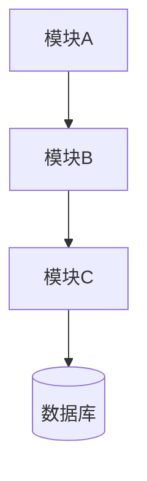
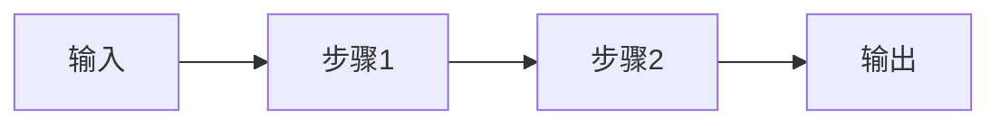
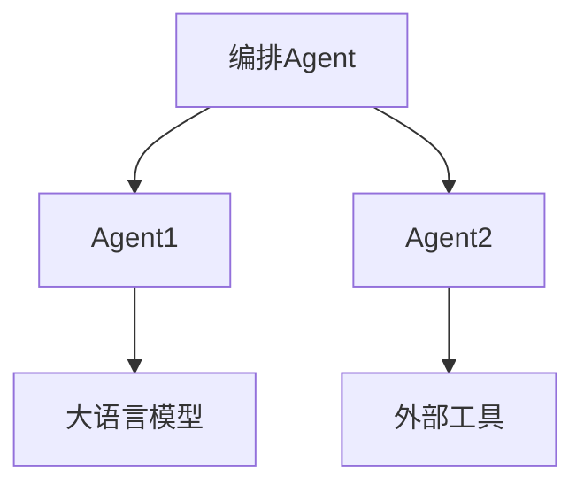

# {项目名称}

> {一句话描述项目核心价值}

---

## 项目简介

{项目背景、要解决的问题、为什么这个问题重要、目标用户、项目价值}

---

## 核心能力

### {功能1名称}

- **功能**：{功能描述}
- **解决的问题**：{痛点}
- **价值**：{带来的好处}

### {功能2名称}

- **功能**：{功能描述}
- **解决的问题**：{痛点}
- **价值**：{带来的好处}

### {功能3名称}

- **功能**：{功能描述}
- **解决的问题**：{痛点}
- **价值**：{带来的好处}

---

## 效果展示

**输入示例**：

```
{输入内容}
```

**输出示例**：

```
{输出内容}
```

<!-- TODO: 添加截图或 GIF -->

---

## 应用场景

- **{场景1}**：{描述}
- **{场景2}**：{描述}
- **{场景3}**：{描述}

---

## 安装部署

### 环境要求

- {语言} {版本}+
- {依赖工具}

### 方式一：让 AI 自己安装（最简单）

打开你的 AI 编码工具，直接粘贴以下提示词：

```
请帮我安装 {技能名称}：
1. 克隆仓库：git clone {repo-url}
2. 将技能目录复制到你的技能目录中
3. 确认安装成功后告诉我
```

### 方式二：脚本自动安装

```bash
git clone {repo-url}
cd {project}
{安装命令}
```

### 方式三：手动安装

```bash
{手动安装步骤}
```

---

## 快速开始

```bash
# 1. 安装（详见「安装部署」章节）
# 2. {最短上手步骤}
```

---

## 使用说明

### 触发方式

```
{触发命令或自然语言示例}
```

### 使用流程

{步骤说明 + 示例}

---

## 系统架构



| 模块 | 职责 |
|------|------|
| 模块A | {职责描述} |
| 模块B | {职责描述} |
| 模块C | {职责描述} |

---

## 核心工作流程



1. **步骤1**：{描述}
2. **步骤2**：{描述}
3. **步骤3**：{描述}

---

## AI 工作流程

<!-- 仅当项目涉及 AI 时包含此章节 -->

### Agent 架构



### Prompt Pipeline

{Prompt 设计思路和流转过程}

### RAG 流程

{数据来源、检索方式、Embedding 方案}

### LLM 使用方式

| 模型 | 用途 | 选型理由 |
|------|------|---------|
| {模型名} | {用途} | {理由} |

### 创新点

{与传统方案的对比和创新之处}

---

## 技术栈

| 层级 | 技术 | 用途 | 选型理由 |
|------|------|------|---------|
| 前端 | {技术} | {用途} | {理由} |
| 后端 | {技术} | {用途} | {理由} |
| AI | {技术} | {用途} | {理由} |
| 数据库 | {技术} | {用途} | {理由} |
| 部署 | {技术} | {用途} | {理由} |

---

## 项目结构

```text
{项目名}/
├── src/              # 源代码
├── prompts/          # Prompt 模板
├── tests/            # 测试代码
├── docs/             # 文档
└── docker/           # Docker 配置
```

---

## 配置说明

| 配置项 | 必需 | 默认值 | 说明 |
|--------|------|--------|------|
| {配置项} | {是/否} | {默认值} | {说明} |

---

## 性能与扩展性

- **系统瓶颈**：{分析}
- **成本来源**：{分析}
- **扩展方案**：{方案}
- **优化方向**：{方向}

---

## 安全设计

- **身份认证**：{方式}
- **权限控制**：{模型}
- **数据安全**：{措施}
- **API 安全**：{策略}

---

## 项目亮点

1. **技术创新**：{描述}
2. **工程创新**：{描述}
3. **产品创新**：{描述}

---

## Roadmap

- [x] {已完成的功能}
- [ ] {开发中的功能}
- [ ] {未来规划}

---

## 贡献指南

1. Fork 本仓库
2. 创建功能分支：`git checkout -b feature/your-feature`
3. 提交更改：`git commit -m 'feat: add your feature'`
4. 推送分支：`git push origin feature/your-feature`
5. 提交 Pull Request

---

## FAQ

### {问题1}？

{回答}

### {问题2}？

{回答}

---

## License

本项目基于 {许可证名称} 开源。详见 [LICENSE](LICENSE) 文件。
